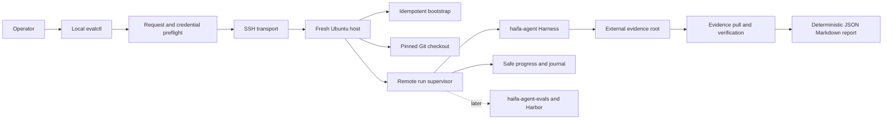

# Haifa Agent 全新主机评测控制面架构方案

- 状态：Draft / Architecture Plan
- 日期：2026-09-09
- 目标仓库：`haifa-agent-eval-infra`
- 第一阶段执行后端：`haifa-agent` Test Harness
- 后续执行后端：`haifa-agent-evals`
- 本文边界：只完成架构与实施规划，不代表已经实现、联调或完成真实评测

## 1. 目标与结论

本项目建设一个独立于产品代码和评测语义的评测基础设施控制面。操作者提供一台已经创建好的全新
Ubuntu 主机及其连接信息，再选择已审核的评测模型和评测范围；控制面负责把主机准备成可运行状态、
执行冻结后的评测、持续展示安全进度、收集完整证据，并以确定性程序生成机器可读和人可读报告。

第一阶段采用 Bring Your Own Host 形态，不负责创建云主机。输入是主机 IP、SSH 用户、SSH 私钥引用、
GitHub 只读凭据引用、精确源码版本、已审核的 Agent Profile、Provider 和模型身份。输出是可校验的
评测证据、运行状态和不依赖大模型生成的 JSON/Markdown/终端报告。

第一阶段直接复用 `haifa-agent` 已有的两阶段 Harness：

```text
plan -> 人工审阅 Plan 和预算 -> run -> evidence -> deterministic report
```

后续增加 `haifa-agent-evals`/Harbor 执行路径。两种路径共享 SSH、主机引导、源码冻结、Secret 边界、
运行生命周期和结果传输，但不共享评测 Case、Verifier、Profile 或 PASS 判定语义。

## 2. 当前场景

### 2.1 第一阶段

第一阶段运行以下两类现有评测：

1. Coding Agent Critical Path：
   - `critical-path-smoke-v1` 用作低成本准入；
   - `critical-path-regression-v1` 与 `critical-path-deep-v1` 构成 CP-01～CP-11 的一次正式覆盖；
   - Smoke 与正式覆盖分别报告，不能把重复 Case 合并成虚假的 `PASS/11`。
2. Autonomous Delivery：
   - `autonomous-delivery-phase-1-v1`：6 次；
   - `autonomous-delivery-phase-2-v1`：3 次；
   - `autonomous-delivery-phase-3-v1`：17 次；
   - 三个独立 Plan 合并后形成 `PASS/26`，单个 Phase 不产生全局结论。

评测过程继续使用 Harness 已有安全心跳。基础设施只负责可靠转发、保存和展示这些进度，不再实现第二套
Case 状态机。

### 2.2 后续阶段

后续使用同一主机控制面运行 `haifa-agent-evals` 中的评测配置，包括 Harbor Trial、环境锁、Verifier、
finalize 和归档。题目选择、Dataset digest、Candidate、Verifier 和报告正确性仍由
`haifa-agent-evals` 负责。

### 2.3 明确不做

第一阶段不做以下事项：

- 不创建云主机、VPC、磁盘、对象存储或云 IAM；
- 不支持 Windows/macOS 评测主机；
- 不做多机调度、分片、自动扩缩容、Spot 恢复或跨主机续跑；
- 不在 Infra 中生成或修改 Agent Profile、Suite、Case、预算或模型 Binding；
- 不根据自然语言临时拼装 Provider 配置；
- 不自动扩大评测范围，不把失败自动重试伪装成 repetition；
- 不使用大模型总结报告；
- 不创建 Web Dashboard，第一阶段使用终端进度和静态报告；
- 不在本仓库保存任何私钥、API Key、OAuth Token 或 Secret 明文。

## 3. 仓库职责边界

| 仓库 | 第一阶段职责 | 不属于它的职责 |
| --- | --- | --- |
| `haifa-agent` | Harness、Critical Path Catalog、Autonomous Delivery Catalog、执行与证据契约 | 主机接管、SSH 凭据、跨机器结果传输 |
| `haifa-agent/docs` | 架构和工程文档；同时满足当前 Harness 对独立 `docs` 路径的要求 | 评测运行状态和结果 |
| `haifa-agent/test-config` | Suite、Matrix、Agent Profile、私有 Fixture、冻结预算 | 主机安装和 SSH 生命周期 |
| `haifa-agent-eval-infra` | 主机预检、引导、源码冻结、Secret 注入、Harness 编排、证据拉取、确定性报告 | Case 选择、Provider 协议发明、PASS 语义 |
| `haifa-agent-evals` | 后续 Benchmark 配置、Dataset/Task 锁、Harbor、Verifier、finalize | 第一阶段主机控制与 CP/AD 语义 |

Infra 必须消费已存在且已审核的 `agentProfileRef`。用户输入的 `providerId` 和 `modelId` 是交叉校验项：
它们必须与 Profile 解析后的精确身份一致；不一致或 Profile 不存在时 fail closed。一个新 Provider/模型的
准入必须先在 `haifa-agent` 和 `test-config` 完成协议、配置、价格和 Contract Test，不由 Infra 绕过。

## 4. 架构总览



### 4.1 本地控制端

本地控制端是唯一接受用户输入和本地 Secret 引用的入口，负责：

- 校验 Run Request；
- 校验远端 SSH Host Key；
- 检查本地私钥文件权限，但不读取或打印私钥内容；
- 通过 SSH 执行有界、参数化的远端动作；
- 生成 Plan 后停止并等待人工审阅；
- 转发 Harness 安全进度；
- 拉取 Evidence Root，验证清单并生成报告；
- 在本地维护每个 Run 的控制记录，不使用数据库。

### 4.2 远端主机代理

第一阶段不部署常驻网络服务。远端由 root 所有的固定脚本和一个受限的 `haifa-eval` 系统用户组成；运行
任务由 systemd transient unit 或等效的本机 supervisor 承载，从而在操作者 SSH 断开后继续执行。

远端代理不得监听新的公网端口。状态和日志均通过现有 SSH 通道读取。

### 4.3 执行驱动

第一阶段只有一个具体驱动：`haifa-harness`。它负责按顺序调用仓库现有的 `run-suite.sh plan/run`，并
保存 Plan、审批记录、退出码和 Evidence Root 引用。

后续增加第二个具体驱动：`haifa-evals-harbor`。实现前只保留清晰的驱动边界，不先建设动态插件系统或
通用 SPI。两个确认消费者的共同输入仅限主机、源码、Secret、生命周期和 Artifact 传输。

## 5. Run Request 契约

Run Request 是不含 Secret 值的版本化 YAML。正式运行必须保存其规范化 JSON、SHA-256 和操作者批准
记录。建议 V1 结构如下：

```yaml
schemaVersion: 1
runId: zhipu-glm53-ubuntu-20260909-001

target:
  address: 203.0.113.10
  port: 22
  user: eval-admin
  hostKeySha256: SHA256:<approved-host-key-fingerprint>
  sshPrivateKeyFileEnv: HAIFA_EVAL_HOST_SSH_KEY_FILE
  requirePasswordlessSudo: true

source:
  githubPrivateKeyFileEnv: HAIFA_EVAL_GITHUB_SSH_KEY_FILE
  repositories:
    product:
      url: git@github.com:<owner>/haifa-agent.git
      commit: <40-char-sha>
    docs:
      url: git@github.com:<owner>/haifa-agent-internal-docs.git
      commit: <40-char-sha>
    testConfig:
      url: git@github.com:<owner>/haifa-agent-test-config.git
      commit: <40-char-sha>

evaluation:
  kind: haifa-harness
  providerId: zhipu
  modelId: glm-5.3-flash
  agentProfileRef: coding-zhipu-glm53-flash
  requiredSecretEnvironmentNames:
    - BIGMODEL_API_KEY
    - ALIYUN_IQS_API_KEY
  runs:
    - id: cp-smoke
      suite: critical-path-smoke-v1
      platform: linux-primary
      approveBudget: "5"
      reportRole: admission
    - id: cp-regression
      suite: critical-path-regression-v1
      platform: linux-primary
      approveBudget: "20"
      reportRole: formal
    - id: cp-deep
      suite: critical-path-deep-v1
      platform: linux-primary
      approveBudget: "20"
      reportRole: formal
    - id: ad-phase-1
      suite: autonomous-delivery-phase-1-v1
      platform: linux-host-default
      approveBudget: "900"
      reportRole: formal
    - id: ad-phase-2
      suite: autonomous-delivery-phase-2-v1
      platform: linux-host-default
      approveBudget: "450"
      reportRole: formal
    - id: ad-phase-3
      suite: autonomous-delivery-phase-3-v1
      platform: linux-host-default
      approveBudget: "2550"
      reportRole: formal

output:
  remoteEvidenceRoot: /var/lib/haifa-eval/evidence
  localResultRoot: D:/haifa-agent-eval-results
  retainRemoteEvidenceAfterPull: true
```

上述值只是契约示例，不是已批准的 GLM-5.3-Flash 配置或预算。正式实现必须从已检出的 Profile 和 Suite
重新解析并比对以下事实：

- Profile 的 Provider ID、模型 ID、API style、dialect、endpoint 和配置 SHA-256；
- Profile 派生出的全部必需环境变量，而不是只检查主模型 API Key；
- Suite 的 Case、repetition、blocking 和预算单位；
- Profile baseline 是否是产品 commit 的祖先；
- 主仓、`docs` 和 `test-config` 三仓是否位于精确 commit 且 clean；
- Harness 生成的 Plan 内容与 Run Request 是否一致。

任一不一致均停止，不自动改写请求或使用“最新版本”。

## 6. 凭据与信任边界

### 6.1 凭据分类

| 凭据 | 用途 | V1 约束 |
| --- | --- | --- |
| Host SSH 私钥 | 本地控制端连接评测主机 | 只存在于操作者本机；与 GitHub Key 分离 |
| GitHub SSH 私钥 | 远端只读检出三个仓库 | 专用只读机器身份；不得使用个人通用写权限 Key |
| Provider API Key | Harness 调用模型/Web Provider | 只经 SSH stdin 进入远端 tmpfs 环境文件 |
| SSH Host Key | 防止连接到错误或被劫持的主机 | 指纹必须冻结在 Request 或先人工确认 |

“GitHub 私钥”在 V1 中明确解释为一个专用 SSH 只读机器身份。若三个仓库无法共享同一只读身份，则
Run Request 应扩展为逐仓 Credential Ref；不能把同一 Deploy Key 强行复用，也不能退回个人写权限 Key。
后续可增加 GitHub App 短期 installation token，但 V1 不同时实现两套认证路径。

### 6.2 禁止的 Secret 载体

Secret 值不得进入：

- Git、Run Request、示例配置或测试 Fixture；
- 命令行参数、进程标题、systemd `Environment=`、cloud-init 或 shell history；
- SSH debug 输出、日志、Plan、报告、Evidence Manifest；
- Maven/Gradle 配置、Git remote URL 或 Git credential store；
- 长期远端磁盘、归档和错误堆栈。

模型和 Web Secret 通过 SSH stdin 写入 `/run/haifa-eval/<runId>/secrets.env`，文件权限为 `0600`，目录
仅 `haifa-eval` 可读。systemd 使用 `EnvironmentFile=` 引用路径，运行终止后删除。`/run` 必须是 tmpfs；
不满足时 fail closed。

GitHub Key 只在源码检出窗口内进入独立临时目录，权限 `0600`，通过固定的 `GIT_SSH_COMMAND` 使用；检出
和 commit 校验完成后立即删除。禁止 SSH Agent Forwarding，因为被接管主机可在连接存续期间使用操作者
Agent 中的其他身份。

### 6.3 SSH 安全

- 禁止 `StrictHostKeyChecking=no`；
- 第一次发现 Host Key 只能输出指纹，不能同时继续有副作用的 bootstrap；
- 远端账户必须支持非交互、无密码 sudo，且只用于主机初始化；
- 完成 bootstrap 后，评测进程使用非 root 的 `haifa-eval` 用户；
- SSH 命令采用固定动作和逐参数传递，不拼接任意 shell 字符串；
- 日志命令不读取 `/proc/*/environ`、Secret 文件或完整环境。

## 7. 远端目录与权限

建议使用以下固定布局：

```text
/opt/haifa-eval/                         root:root, scripts and version manifest
/var/lib/haifa-eval/
  runs/<runId>/control/                  request digest, lifecycle, exit codes
  worktrees/<runId>/haifa-agent/         exact product checkout
    docs/                                exact docs checkout
    test-config/                         exact test-config checkout
  plans/<runId>/                         Harness plans pending approval
  evidence/<runId>/                      repository-external Harness run root
/run/haifa-eval/<runId>/                 tmpfs secrets, removed on completion
```

`evidence/<runId>` 必须与三个 Git 仓库、用户 Home 和文件系统根都不重叠。源码目录在 Plan 和 Run 之间
不得修改；任何 tracked/untracked/file-mode 变化均使本次执行失败。不得在新主机上使用 `sed -i` 修改已
检出的脚本换行符，也不得用 `chmod` 修补仓库应当保存的 executable bit。

## 8. 主机引导与可重现性

### 8.1 支持基线

V1 支持 Ubuntu 26.04 LTS 的 `x86_64` 和 `aarch64`。不能硬编码 `java-21-openjdk-amd64` 路径；应从
`command -v java/javac` 和物理路径推导 JDK Home，并验证二者来自同一 JDK。

主机至少需要：

- Bash、Git、OpenSSH Client、curl、jq、ca-certificates；
- JDK 21，且 `java`/`javac` 一致；
- Python 3、Node.js、Go；
- Maven Wrapper 运行所需网络或已审核缓存；
- 足够的磁盘、文件描述符和进程限额；
- 到 GitHub、Maven 仓库、Provider endpoint、Web Provider 和所需 MCP 的网络可达性。

第一阶段只验证 Harness 实际要求的工具，不凭想象增加 Docker、Harbor、uv 或云 CLI。后续
`haifa-agent-evals` 驱动再显式增加 Docker/Harbor/uv 与更高磁盘容量。

### 8.2 第一阶段软件包安装

新主机不能依赖人工逐项安装。Infra 的 bootstrap 动作负责使用 Ubuntu 官方 APT 源安装第一阶段的最小
软件集合，并把解析后的包版本写入 Host Facts。安装动作只有在 SSH Host Key 已确认、只读 doctor 通过且
操作者明确批准主机变更后才能执行。

#### 8.2.1 APT 包清单

| 组 | Ubuntu 包 | 用途 |
| --- | --- | --- |
| 基础传输 | `ca-certificates`、`curl`、`wget`、`git`、`openssh-client` | GitHub、Maven 和 HTTPS 访问 |
| 归档与报告传输 | `jq`、`tar`、`unzip`、`zip`、`xz-utils`、`rsync` | Plan/Evidence 检查、归档和断点传输 |
| Java | `openjdk-21-jdk-headless` | Harness、Maven Wrapper、Java Case；必须同时提供 `java` 和 `javac` |
| 本机构建 | `build-essential` | C/C++ 编译器、`make` 和部分依赖的本机构建 |
| Python | `python3`、`python3-venv`、`python3-pip` | Harness 启动脚本、Python Case 和隔离环境 |
| Node.js | `nodejs`、`npm` | JavaScript/Node.js Case |
| Go | `golang-go` | Go Case |
| 运行诊断 | `procps`、`psmisc`、`lsof`、`acl`、`util-linux` | 进程树、文件占用、权限和主机诊断 |
| 区域与时间 | `locales`、`tzdata` | UTF-8 locale 和时间事实 |

V1 不安装系统 Maven，始终使用主仓 `mvnw`。也不安装 Docker、Harbor、uv、OpenTofu、Cloud CLI、桌面
环境、数据库 Server 或通用开发 IDE。`sqlite3` CLI 不是当前 Harness 的运行前置；SQLite 由 Java 依赖
提供。目标主机已经能通过 SSH 登录，因此 bootstrap 不重装或改写 `openssh-server` 配置。

安装器生成的等价 APT 动作如下；生产实现应从版本化包锁生成参数，而不是允许操作者追加任意包名：

```bash
sudo apt-get update
sudo env DEBIAN_FRONTEND=noninteractive apt-get install -y --no-install-recommends \
  ca-certificates curl wget git openssh-client \
  jq tar unzip zip xz-utils rsync \
  openjdk-21-jdk-headless build-essential \
  python3 python3-venv python3-pip \
  nodejs npm golang-go \
  procps psmisc lsof acl util-linux locales tzdata
```

不配置不受控的第三方 APT 源，也不使用 `curl | sh`。如果 Ubuntu 26.04 官方源不能提供所需主版本，
bootstrap 必须停止并报告 `PACKAGE_BASELINE_UNAVAILABLE`；不能临时改用其他发行版、Snap、SDKMAN、nvm、
pyenv 或未校验二进制继续运行。

#### 8.2.2 架构无关的 Java 解析

安装后从可执行文件物理路径解析 JDK，不能按 CPU 架构拼接目录名：

```bash
eval_java="$(readlink -f "$(command -v java)")"
eval_javac="$(readlink -f "$(command -v javac)")"
eval_java_home="$(dirname "$(dirname "$eval_java")")"

test "$eval_java_home" = "$(dirname "$(dirname "$eval_javac")")"
test -x "$eval_java_home/bin/java"
test -x "$eval_java_home/bin/javac"
```

supervisor 为 Harness 显式设置解析后的 `JAVA_HOME`，同时可设置
`HAIFA_JAVA_EXECUTABLE`/`HAIFA_JAVAC_EXECUTABLE`。`x86_64` 和 `aarch64` 使用相同解析流程。

#### 8.2.3 安装后版本验收

bootstrap 必须逐项运行并记录退出码与不含 Secret 的版本输出：

```bash
cat /etc/os-release
uname -m
dpkg --print-architecture
java -version
javac -version
python3 --version
node --version
npm --version
go version
git --version
bash --version
curl --version
jq --version
```

验收规则：

- OS 必须是 Request 支持的 Ubuntu release，architecture 必须是 `amd64` 或 `arm64`；
- Java/Javac 主版本必须为 21，且物理路径属于同一 JDK；
- Python、Node.js 和 Go 不只检查“命令存在”，还要满足 bootstrap lock 的最低版本；
- `C.UTF-8` 必须可用，supervisor 固定 `LANG=C.UTF-8`、`LC_ALL=C.UTF-8`；
- systemd unit 固定 `LimitNOFILE=65536`，不能依赖一次 SSH Shell 的 `ulimit`；
- 所有必需可执行文件必须是普通文件，解析后的物理路径写入 Host Facts；
- 任一版本输出无法解析或低于锁定下限时，在源码检出和 Provider Secret 注入前失败。

安装后的 APT 事实至少包含：

```text
os-release.json
architecture.json
apt-sources.sha256
installed-packages.tsv
toolchain.json
bootstrap-lock.sha256
```

`installed-packages.tsv` 记录上述受管包的 `binary package + exact installed version + architecture`。它用于
追溯，不包含整个主机软件清单，避免把无关主机信息带入评测报告。

#### 8.2.4 安装顺序与失败边界

完整 bootstrap 顺序固定为：

1. 只读确认 `/etc/os-release`、CPU architecture、磁盘、DNS、时间和 passwordless sudo；
2. 检查 Ubuntu 官方源中所有锁定包是否可解析；
3. 输出待安装/升级的软件包和版本计划，等待明确批准；
4. 执行一次非交互 APT 安装；
5. 解析 Java/Javac 物理路径并校验 JDK 21；
6. 校验 Python、Node.js、Go、Git、Bash 和辅助工具版本；
7. 创建 `haifa-eval` 用户、目录和 systemd 资源限制；
8. 写入 Host Facts 和 bootstrap lock digest；
9. 重新运行只读 doctor；
10. doctor 通过后才允许进入 GitHub 源码检出。

APT 安装失败时保留经过脱敏的 package manager 退出码和日志，但不自动执行 `apt --fix-broken install`、
发行版升级或第三方源回退。用户修复主机后可以幂等重跑 bootstrap。

#### 8.2.5 不属于第一阶段的包

以下软件只在实现 `haifa-agent-evals` 驱动时增加，并使用单独的 bootstrap profile：

| 后续软件 | 引入条件 |
| --- | --- |
| Docker Engine、CLI、Buildx | Harbor/Trial 容器执行方案定稿并完成 metadata/Secret 隔离设计 |
| `uv` | `haifa-agent-evals` 的 `uv.lock` 和支持版本已冻结 |
| Harbor | 精确版本、安装来源和插件/Verifier 契约已冻结 |
| Registry/Cloud CLI | 明确采用某个 Artifact Registry 或云归档后再加入 |

Utility MCP 也不是一个可随意从 APT 安装的通用包。第一阶段必须另行冻结其仓库或发布制品、commit/digest、
Java 入口、监听地址、健康检查和关闭流程；这些事实未确定前，CP-09 保持不可运行，而不是安装一个同名
第三方软件代替。

### 8.3 Bootstrap Lock

Infra 仓库应维护一个版本化的 bootstrap lock，记录每个受支持 OS/architecture 的工具最低版本、推荐
版本、安装来源和校验方式。由于输入是外部创建的全新主机，V1 能保证源码、Profile、Plan、工具版本和
证据可追溯，不能声称 OS 镜像字节级可重现。

bootstrap 可以重复运行，但只能完成以下收敛动作：

- 创建 `haifa-eval` 用户和目录；
- 安装/验证 lock 声明的工具；
- 安装同版本远端执行脚本；
- 写入不含 Secret 的主机事实；
- 不启动评测、不读取 Provider Secret、不修改已检出的仓库。

## 9. 生命周期与动作

V1 不使用数据库。每个 Run 在本地和远端各维护一个 append-only `lifecycle.jsonl`，事件只包含时间、阶段、
退出码、非敏感原因码和 Artifact 引用。

```text
REQUEST_VALIDATED
  -> HOST_TRUSTED
  -> HOST_PREFLIGHTED
  -> BOOTSTRAPPED
  -> SOURCE_PINNED
  -> MODEL_PROFILE_VERIFIED
  -> PLAN_CREATED
  -> WAITING_APPROVAL
  -> RUNNING
  -> EVIDENCE_READY
  -> EVIDENCE_PULLED
  -> REPORT_READY
  -> COMPLETE
```

任一阶段可进入 `FAILED_<STAGE>` 或 `CANCELLED`。`FAILED` 不等于已清理，`SSH_DISCONNECTED` 不等于
Run 失败，Harness 进程退出也不等于 Case PASS。

建议未来 CLI 只公开以下有界动作：

```text
evalctl request validate --file <request>
evalctl host trust --file <request>
evalctl host doctor --file <request>
evalctl host bootstrap --file <request>
evalctl source prepare --file <request>
evalctl plan --file <request>
evalctl run --file <request> --approved-plan-set <digest>
evalctl status --run-id <id>
evalctl logs --run-id <id> [--follow]
evalctl collect --run-id <id>
evalctl report --run-id <id> [--format terminal|json|markdown]
evalctl cleanup --run-id <id>
```

`plan` 结束后必须停在 `WAITING_APPROVAL`。`run` 需要冻结后的 Plan Set 摘要和每个 Suite 的明确预算批准；
不能因为 Request 中存在预算值就自动视为已批准。

## 10. 第一阶段执行流程

### 10.1 请求与主机准入

1. 校验 Request schema、`runId` 唯一性、输出目录边界和 Secret 环境变量名称；
2. 发现并人工确认 SSH Host Key，冻结指纹；
3. 只读检查 OS、architecture、sudo、磁盘、时间、DNS 和外部网络；
4. 验证 Host SSH Key 与 GitHub Key 是不同文件；
5. 验证本地结果根不位于任何源码仓库中。

### 10.2 主机引导

1. 安装或验证工具链；
2. 创建受限用户和标准目录；
3. 写入工具版本、OS release、architecture 和 bootstrap lock digest；
4. 验证 `/run` 为 tmpfs；
5. 不读取模型 Secret，不运行 Maven/Harness。

### 10.3 精确源码准备

1. 临时注入 GitHub 只读 SSH Key；
2. 分别 fetch 三个仓库的精确 40 字符 commit；
3. 按 `haifa-agent/{docs,test-config}` 形成独立 Git 仓拓扑；
4. 验证 commit、remote identity、clean status 和 Profile baseline；
5. 删除远端 GitHub Key；
6. 生成三仓 Source Manifest 和 SHA-256。

不允许以 branch、tag 或 `latest` 作为最终冻结身份。它们可以帮助发现 commit，但 Run Request 最终必须
保存完整 SHA。

### 10.4 模型与依赖准入

在任何付费调用前完成：

1. 解析 Agent Profile 并比对 `providerId`、`modelId`、dialect 和 endpoint；
2. 校验 Profile configuration SHA-256；
3. 校验所有必需 Secret 环境变量在本地存在，但不打印长度、前后缀或摘要；
4. 校验 Web Provider 和 Utility MCP 的依赖策略；
5. MCP Case 被选中时必须先启动并健康检查已审核的 Utility MCP；
6. 对新模型先要求离线 request/stream/tool/continuation Contract Test 已通过；
7. 再执行单次低成本模型连通探针，探针本身需要独立付费授权。

对于当前拟议的 `glm-5.3-flash`，上述准入是实现前置条件。Infra 不得因为 Zhipu 通用方言可接受未来
模型字符串，就将该模型标记为已验证。

### 10.5 Plan Set 与人工批准

Infra 为每个 Suite 单独调用 Harness `plan`，保留原始 Plan，并生成只读 Plan Set：

```json
{
  "schemaVersion": 1,
  "runId": "...",
  "requestSha256": "...",
  "plans": [
    {
      "runEntryId": "cp-smoke",
      "suiteId": "critical-path-smoke-v1",
      "planSha256": "...",
      "budgetUnit": "USD",
      "budget": "5"
    }
  ],
  "planSetSha256": "..."
}
```

人工审阅至少确认：源码 SHA、Profile、Provider、模型、平台、Case/repetition、预算单位、run-root 和
Runner Artifact。批准记录只保存操作者标识、时间和被批准的 Plan Set digest，不保存凭据。

### 10.6 执行与进度

- 每个 Suite 由独立 supervisor unit 执行；
- 按 Request 顺序串行，默认 Smoke 失败后不自动进入正式付费批次；
- 每个后续批次是否继续由 Run Policy 冻结，不能在失败后隐式继续；
- Harness stdout/stderr 写入本地 journal，同时把安全进度行转发给 `evalctl logs/status`；
- 不解析或展示 Prompt、模型原文、reasoning、Tool 参数或环境变量；
- SSH 中断后 supervisor 继续运行，重新连接可恢复查看；
- 取消动作向 supervisor 发出终止请求，并等待 Harness 完成子进程清理；不得仅 kill SSH 会话。

### 10.7 证据收集

每个 Suite 完成后：

1. 读取 Harness 打印的权威 Evidence Root；
2. 确认 `run-result.json`、`secret-scan.json` 和 `manifest.sha256` 存在；
3. 先在远端验证 Manifest，再通过 SSH/SFTP 拉取；
4. 在本地再次验证文件大小和 SHA-256；
5. 记录远端路径、本地路径、根摘要和传输完成时间；
6. 默认保留远端证据，直到操作者明确 cleanup；
7. Evidence 不完整或 Secret Scan 失败时标记 `INVALID_EVIDENCE`，不得生成成功结论。

## 11. 确定性报告

第一阶段报告由普通程序读取白名单字段生成，不调用大模型，也不读取完整模型响应。输出三种形式：

- 终端摘要：方便运行结束立即查看；
- `report.json`：稳定 schema，供后续自动化或 Viewer 消费；
- `report.md`：供人工评审和归档。

### 11.1 报告状态

顶层只能使用以下状态：

| 状态 | 含义 |
| --- | --- |
| `COMPLETE_PASS` | 所有正式批次完成且各自满足其权威 PASS 契约 |
| `COMPLETE_WITH_FAILURES` | 所有计划批次均完成，但存在 Case/Repeat 失败 |
| `INCOMPLETE` | 存在 `NOT_RUN`、中断、超时或未完成批次 |
| `INVALID_EVIDENCE` | Secret Scan、Manifest、仓库稳定性或证据完整性失败 |
| `INFRA_FAILED` | 在 Harness 形成权威结果前由主机、SSH、工具链或传输失败阻断 |

基础设施成功、Harness 退出码为 0、Agent 到达终态和 Case PASS 是不同维度，必须分别呈现。

### 11.2 Critical Path 报告

必须打印：

- Smoke admission 结果，单独于正式分数；
- Regression 与 Deep 的每个 Case、repetition、状态和失败原因；
- 正式 CP-01～CP-11 的覆盖完整性和 `PASS/11`；
- tests/failures/errors/skipped；
- `processTreeNaturalExit`、`repositoryStateStable`、Secret Scan 和 Manifest 状态；
- 主仓、docs、test-config commit、Profile、Provider、模型和平台。

若 Regression 因 blocking Case 停止，后续 `NOT_RUN` 必须逐项列出，不能只打印第一个失败。

### 11.3 Autonomous Delivery 报告

必须打印：

- Phase 1/2/3 各自的 evaluated、PASS 和顶层状态；
- 26 个 Case/repetition 实例逐项明细；
- 每项的 `gatePassed`、`nativeStatus`、`hiddenAcceptance` 和 failure classification；
- 合计 `PASS/26`，但只有三 Phase 都有有效证据时才生成；
- input/output Tokens、模型调用数、工具调用数、平均耗时和当前 Harness 估算成本；
- `providerReportedCostKnown`，避免把估算价格写成真实账单。

### 11.4 报告可信性

报告器不得重新判题。它只把权威 JSON 字段投影为汇总，并在报告中记录每个值的来源文件和 SHA-256。
未知字段、schema 不支持、重复 Case 身份或不一致的 runId 一律 fail closed。

## 12. 失败、恢复与清理

| 失败阶段 | 默认行为 | 是否可原地继续 |
| --- | --- | --- |
| Host trust/preflight | 不改变远端 | 修复输入后重试同一只读动作 |
| Bootstrap | 保留非秘密诊断 | bootstrap 可幂等重跑 |
| Source prepare | 删除临时 GitHub Key，保留失败记录 | 修复后重新创建 worktree |
| Plan | 不注入 Provider Secret | 修复后生成新 Plan Set |
| Run | supervisor 收敛子进程并保留 Evidence | 不把失败 Case 自动重试；新 Run 或新批准决定 |
| Evidence pull | 保留远端 Evidence | 可按 Manifest 幂等重传 |
| Report | 保留原始 Evidence | 修复报告器后从同一 Evidence 重建 |

cleanup 只删除一个已解析、已验证的精确 `runId` 目录和对应 supervisor unit。不得接收 `/`、Home、
`/var/lib/haifa-eval` 根或通配符作为删除目标。删除前必须打印将删除的目录、Evidence 是否已成功拉取及其
本地摘要，并要求显式确认。

## 13. 后续接入 `haifa-agent-evals`

接入时保留第 3 节仓库边界：Infra 消费冻结的 eval config，不选择题目、不替换 Verifier、不计算新的
reward。建议新增的 Run Request 分支为：

```yaml
evaluation:
  kind: haifa-evals-harbor
  evalRepoCommit: <40-char-sha>
  evalConfigPath: evals/<config>.yaml
  evalConfigSha256: <canonical-config-sha256>
  taskEnvironmentLockSha256: <sha256>
  candidateId: haifa
  providerId: <provider>
  modelId: <model>
```

此阶段新增：

- Docker/Harbor/uv 的固定版本和容量预检；
- Dataset、Task、镜像 digest 与环境锁恢复；
- `admit -> run -> finalize`；
- Harbor Verifier reward 与完整归档；
- 对 `haifa-agent-evals` finalizer 输出做原样传输和校验。

Infra 报告只能呈现 finalizer/Verifier 已给出的结果。Agent `VALID`、正常退出、Trace 完整或 Infra
`COMPLETE` 都不能替代 Harbor Verifier PASS。

第一阶段不把 Artifact Registry、GCS、GCP IAM 或临时 VM 生命周期带回实现；这些属于未来明确选择云
供应路径后的独立扩展。SSH Attached Host 和未来 Cloud-Provisioned Host 可以共享 Run Request 的主机
事实，但不能假装云厂商资源模型相同。

## 14. 实施阶段

### Phase 0：设计与前置事实冻结

- 评审本文；
- 确认三个仓库的 URL、访问身份和默认 commit 选择方式；
- 明确 `glm-5.3-flash` 的官方模型身份、Endpoint、计费和工具/continuation 契约；
- 在 `test-config` 形成有效 Profile 和与该 Provider 对应的预算；
- 确认目标主机拥有非交互 sudo、Ubuntu 26.04 和足够容量；
- 决定本地结果根和远端证据保留期。

### Phase 1A：只读控制与离线验证

- Request schema 与 Secret 引用校验；
- Host Key trust 和 SSH doctor；
- bootstrap dry-run/plan；
- 三仓只读 fetch/commit/Profile 检查；
- Harness Plan 生成和 Plan Set 审阅；
- 全部测试使用 Stub/Fake，不访问真实 Provider。

### Phase 1B：主机引导与 Harness 执行

- Ubuntu bootstrap；
- transient supervisor；
- Secret tmpfs 注入；
- Critical Path Smoke、Regression、Deep；
- Autonomous Delivery Phase 1～3；
- status/logs/cancel/collect；
- 确定性 JSON/Markdown/终端报告。

每个真实 Provider 批次仍需单独预算授权，不能由“开始实施”概括授权。

### Phase 1C：可靠性收敛

- SSH 断线与重连；
- Harness 超时和进程树清理；
- Evidence 断点重传与双端校验；
- Secret 泄漏回归；
- x86_64/aarch64 双架构验证；
- 同输入在第二台全新主机重跑。

### Phase 2：`haifa-agent-evals` 驱动

- 引入 evals/Harbor 所需工具链；
- 消费冻结的 eval config 和环境锁；
- 复用主机、Secret、生命周期、Artifact 与报告边界；
- 不改变 `haifa-agent-evals` 的 Verifier 和 finalizer 契约。

## 15. 第一阶段验收标准

- 从一份不含 Secret 的 Request 和本地 Credential 环境，可接管一台全新 Ubuntu 26.04 主机；
- 未确认 SSH Host Key、缺少 sudo、仓库 SHA 不匹配或 Profile 身份不匹配时，在付费调用前失败；
- Host SSH Key、GitHub Key、Provider Key 完全分离且不进入 Git、参数、日志、Plan、Evidence 或报告；
- 三仓使用精确 commit、独立 Git 边界和 clean worktree；
- Harness Plan 生成后停下，只有批准精确 Plan Set 和预算后才执行；
- SSH 断开不终止评测，重连后可以查看 Harness 进度；
- CP Smoke、正式 CP-01～11 和 AD 26 次的范围与计数不会混淆；
- Evidence 在远端和本地均通过 Manifest 校验，Secret Scan 失败时不能产生成功报告；
- 报告由确定性程序生成，同时输出终端、JSON 和 Markdown；
- 报告保留每个失败/未运行实例，不只给汇总比例；
- cleanup 只作用于精确 Run，且默认在本地证据校验成功后进行；
- 普通测试和 doctor 不创建云资源、不调用真实模型、不产生 Provider 费用。

## 16. 实施前需要用户确认的输入

以下项目不影响本文架构，但开始生产代码前必须冻结：

1. 三个 GitHub 仓库的准确 SSH URL，以及 GitHub 凭据是只读机器用户 Key 还是逐仓 Deploy Key；
2. 主机 SSH 用户是否具备 passwordless sudo；
3. SSH Host Key 指纹的可信获取渠道；
4. 第一台主机的 architecture、CPU、内存、磁盘和网络出口限制；
5. `glm-5.3-flash` 的官方模型 ID、定价、上下文、最大输出和已审核 Profile；
6. Utility MCP 的获取、启动和健康检查方式；
7. 本地结果根、远端 Evidence 保留时间和 cleanup 的人工确认策略；
8. 首轮只执行 CP Smoke，还是在每个独立预算批准后继续完整 CP 与 AD。

在这些输入确认前，本项目保持设计状态，不开始生产实现，也不执行任何真实评测。
